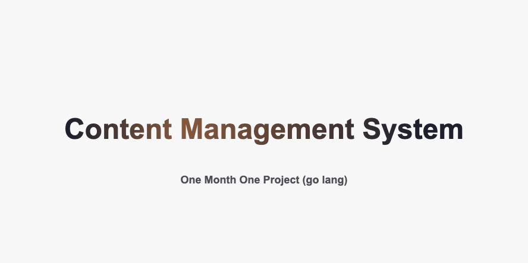
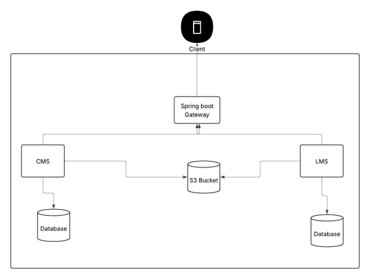

# Content Management System (CMS) - Complete Repository Architecture 

<div align="center">


</div>



## 🌟 Repository Overview

This CMS platform implements a sophisticated microservices architecture with multiple backend services, comprehensive infrastructure management, and extensive learning components for educational content delivery.

---

## 📁 Complete Project Structure

```
.
├── README.md
├── Makefile                              # Build automation and tasks
├── backend/
│   ├── cms-sys/                          # Core CMS Service (Go)
│   ├── gateway/                          # API Gateway Service (Spring Boot)
│   └── lms-sys/                          # Learning Management System (Go)
├── components-learning/                   # Educational Components & Examples
│   ├── certificate_signing/              # Digital Certificate Generation
│   ├── docker/                           # Docker Learning Examples
│   ├── elastic-search/                   # Search Implementation
│   ├── mfa/                              # Multi-Factor Authentication
│   └── postgres/                         # Database Examples
├── docker-compose.yml                     # Main Orchestration
├── infra/                                # Infrastructure as Code
│   ├── migration/                        # Database Migrations
│   ├── github/                           # CI/CD Configuration
│   ├── schema/                           # Database Schemas
│   └── terraform/                        # Infrastructure Provisioning
├── keys/                                 # Cryptographic Keys
├── scripts/                              # Automation Scripts
└── vault-init.sh                         # Vault Initialization
```

---

# CMS High level 



# API level overview


## 🏛️ Architecture Overview

### 🚀 Backend Services (`backend/`)

<details>
<summary><strong>📦 CMS Core System</strong> (<code>cms-sys/</code>)</summary>

**Technology**: Go 1.24 | **Purpose**: Primary content management functionality

```
cms-sys/
├── cmd/main.go                           # Application entry point
├── internal/                             # Core business logic
│   ├── handler/                          # HTTP handlers
│   ├── repository/                       # Data access layer
│   ├── routes/                           # API route definitions
│   ├── service/                          # Business logic layer
│   └── types/                            # Data structures
├── pkg/utils/                            # Shared utilities
├── Makefile                              # Build and development tasks
└── test/                                 # Test suites
```

**Key Features**:
- ✅ Authentication & authorization
- 📝 Content CRUD operations
- 🔐 JWT token management
- 💾 Database abstraction
- ❤️ Health monitoring
</details>

<details>
<summary><strong>🌐 API Gateway</strong> (<code>gateway/</code>)</summary>

**Technology**: Spring Boot (Java 17) | **Purpose**: Service orchestration and routing

```
gateway/
├── src/main/java/com/content_management_system/gateway/
│   └── GatewayApplication.java           # Spring Boot application
├── src/main/resources/
│   └── application.yml                   # Configuration
├── Makefile                              # Java build automation
└── src/test/                             # Integration tests
```

**Key Features**:
- 🔄 Request routing and load balancing
- 📊 Cross-cutting concerns (logging, monitoring)
- 📋 API versioning and documentation
- 🛡️ Security policies enforcement
</details>

<details>
<summary><strong>📚 Learning Management System</strong> (<code>lms-sys/</code>)</summary>

**Technology**: Go 1.24 | **Purpose**: Educational content delivery

```
lms-sys/
├── cmd/main.go                           # LMS application entry
├── internal/                             # LMS-specific logic
│   ├── config/                           # Configuration management
│   ├── handler/                          # LMS API handlers
│   ├── model/                            # Domain models
│   ├── repository/                       # Data persistence
│   └── service/                          # Business services
├── pkg/utils/                            # LMS utilities
└── Makefile                              # Build and development tasks
```

**Key Features**:
- 📖 Course management
- 📈 Student progress tracking
- 🎯 Assessment and grading
- ⚡ Content delivery optimization
</details>

---

### 🧩 Learning Components (`components-learning/`)

<table>
<tr>
<td width="50%">

**🏆 Certificate Signing** (`certificate_signing/`)
- Digital certificate generation and validation
- PDF certificate creation with cryptographic signatures
- Private key management and security

**🐳 Docker Orchestration** (`docker/`)
- Multi-service containerization examples
- Service discovery and communication
- Container networking and scaling

</td>
<td width="50%">

**🔍 Elasticsearch Integration** (`elastic-search/`)
- Full-text search implementation
- Product catalog search optimization
- Real-time indexing and querying

**🔐 Multi-Factor Authentication** (`mfa/`)
- TOTP (Time-based One-Time Password) implementation
- Security token generation and validation
- Authentication flow optimization

</td>
</tr>
</table>

**🐘 PostgreSQL Advanced Features** (`postgres/`)
- **Schema Management**: Multi-tenant architecture patterns
- **Geometric Data**: PostGIS spatial data handling
- **Functions & Domains**: Advanced SQL programming
- **GORM Integration**: Go ORM implementation

---

### 🏗️ Infrastructure (`infra/`)

<div align="center">
<table>
<tr>
<th>Component</th>
<th>Description</th>
<th>Technology</th>
</tr>
<tr>
<td><strong>Database Management</strong></td>
<td>
• CMS Schema: Content management database structure<br>
• LMS Schema: Learning management database design<br>
• Migration Tools: Database version control<br>
• Diagrams: Visual database architecture
</td>
<td>PostgreSQL, Migrations</td>
</tr>
<tr>
<td><strong>Infrastructure as Code</strong></td>
<td>
• Cloud resource provisioning<br>
• Environment-specific configurations<br>
• Scalability and high availability setup
</td>
<td>Terraform</td>
</tr>
<tr>
<td><strong>CI/CD Pipeline</strong></td>
<td>
• Automated testing and deployment<br>
• Code quality enforcement<br>
• Security scanning integration
</td>
<td>GitHub Actions</td>
</tr>
</table>
</div>

---

## 🔧 Development & Operations

### **🔨 Build Automation** (`Makefile`)
- Cross-platform build commands
- Development environment setup
- Testing and linting automation
- Docker image building

### **🔐 Security & Cryptography** (`keys/`)
- RSA key pair management
- Encryption/decryption utilities
- Secure communication setup

### **⚙️ Automation** (`scripts/`)
- Deployment automation
- Environment setup scripts
- Maintenance and monitoring tools

### **🐋 Service Orchestration** (`docker-compose.yml`)
- Multi-service local development
- Service dependency management
- Environment variable configuration

---

## 🎯 Design Principles & Patterns

<div align="center">


</div>

### **🏗️ Microservices Architecture**
- **Service Independence**: Each service can be developed, deployed, and scaled independently
- **Technology Diversity**: Go 1.24 for performance-critical services, Java 17 for gateway complexity
- **Data Isolation**: Each service maintains its own database and data models

### **🧹 Clean Architecture Implementation**
- **Separation of Concerns**: Clear boundaries between presentation, business, and data layers
- **Dependency Inversion**: Business logic independent of external frameworks
- **Testability**: Comprehensive testing at unit, integration, and system levels

### **🏭 Infrastructure as Code**
- **Reproducible Environments**: Consistent deployment across development, staging, and production
- **Version Control**: Infrastructure changes tracked and reviewed
- **Automation**: Minimal manual intervention in deployment processes

### **🔒 Security-First Design**
- **Authentication**: Multi-factor authentication and JWT token management
- **Authorization**: Role-based access control across services
- **Encryption**: End-to-end encryption for sensitive data
- **Certificate Management**: Digital certificates for document authenticity

---

## 🚀 Deployment & Scalability

<div align="center">
<table>
<tr>
<th>🏠 Local Development</th>
<th>☁️ Cloud Deployment</th>
</tr>
<tr>
<td>Docker Compose for rapid development cycles</td>
<td>Terraform for cloud infrastructure</td>
</tr>
<tr>
<td>Make commands for consistent builds</td>
<td>Auto-scaling and load balancing</td>
</tr>
<tr>
<td>Hot reloading and debugging</td>
<td>Multi-region deployment</td>
</tr>
</table>
</div>

---
# 🤝 Contribution Guide

<div align="center">


</div>

---

## 🚀 Getting Started

Follow these steps to contribute to the Multi-Tenant CMS project:

### 📥 Step 1: Clone the Repository

```bash
git clone https://github.com/one-project-one-month/multi-tenants-cms-golang.git
cd multi-tenant-cms-golang
```

### 🌿 Step 2: Create Feature Branch

```bash
# Create and switch to your feature branch
git checkout -b ft-CM-<according-to-your-ticket>

# Example: git checkout -b ft-CM-user-authentication
```

> **📝 Branch Naming Convention**: Use `ft-CM-<feature-description>` format based on your assigned ticket

---

## 💻 Development Workflow

### ✏️ Step 3: Code Implementation

- **Focus**: Work only on your assigned ticket/feature
- **Quality**: Follow project coding standards
- **Testing**: Ensure your code is properly tested

### 🔍 Step 4: Check Your Changes

```bash
# Review what files have been modified
git status

# Review the actual changes
git diff
```

### 📦 Step 5: Stage Your Changes

```bash
# Add specific file(s)
git add <fileName>

# Or add all changes (use with caution)
git add .

# Or add multiple specific files
git add file1.go file2.go
```

### 📝 Step 6: Commit Your Changes

```bash
git commit -m "feat: add user authentication middleware

- Implement JWT token validation
- Add role-based access control
- Include unit tests for auth handlers"
```

> **💡 Commit Message Format**: Use conventional commits format:
> - `feat:` for new features
> - `fix:` for bug fixes
> - `docs:` for documentation
> - `test:` for adding tests
> - `refactor:` for code refactoring

---

## 🔄 Synchronization & Push

### 🔃 Step 7: Stay Up-to-Date

```bash
# Fetch latest changes from remote
git fetch origin

# Pull latest changes to avoid conflicts
git pull origin ft-CM-<according-to-your-ticket>
```

### 🚀 Step 8: Push Your Changes

```bash
# Push your feature branch to remote
git push origin ft-CM-<according-to-your-ticket>

# If it's your first push on this branch
git push -u origin ft-CM-<according-to-your-ticket>
```

---

## 📋 Quick Reference

<div align="center">
<table>
<tr>
<th>Command</th>
<th>Purpose</th>
<th>Example</th>
</tr>
<tr>
<td><code>git status</code></td>
<td>Check working directory status</td>
<td>See modified files</td>
</tr>
<tr>
<td><code>git diff</code></td>
<td>Show changes in files</td>
<td>Review code changes</td>
</tr>
<tr>
<td><code>git add</code></td>
<td>Stage files for commit</td>
<td><code>git add main.go</code></td>
</tr>
<tr>
<td><code>git commit</code></td>
<td>Save changes with message</td>
<td><code>git commit -m "fix: resolve auth bug"</code></td>
</tr>
<tr>
<td><code>git push</code></td>
<td>Upload changes to remote</td>
<td><code>git push origin ft-CM-auth</code></td>
</tr>
</table>
</div>

---

##  Pro Tips


```bash
# View commit history
git log --oneline

# Undo last commit (keep changes)
git reset --soft HEAD~1

# Stash current changes
git stash

# Apply stashed changes
git stash pop

# Check remote branches
git branch -r

```
---

## 🎯 After Push

1. **Create Pull Request**: Go to GitHub and create a PR from your feature branch
2. **Code Review**: Wait for team review and address feedback
3. **Merge**: Once approved, your changes will be merged to main branch
4. **Cleanup**: Delete your feature branch after successful merge

---

