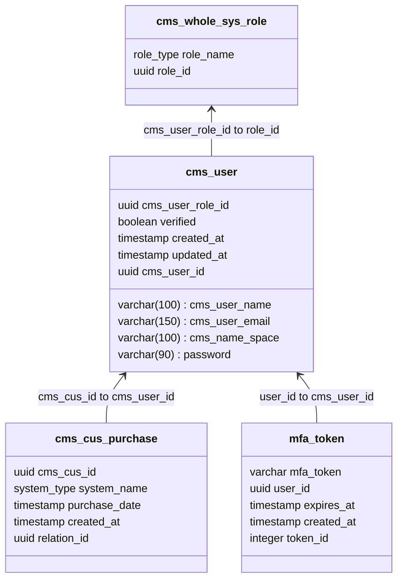

```mermaid

classDiagram
    direction BT
    class cms_cus_purchase {
        uuid cms_cus_id
        system_type system_name
        timestamp purchase_date
        timestamp created_at
        uuid relation_id
    }
    class cms_user {
        varchar(100) cms_user_name
        varchar(150) cms_user_email
        varchar(100) cms_name_space
        varchar(90) password
        uuid cms_user_role_id
        boolean verified
        timestamp created_at
        timestamp updated_at
        uuid cms_user_id
    }
    class cms_whole_sys_role {
        role_type role_name
        uuid role_id
    }
    class mfa_token {
        varchar mfa_token
        uuid user_id
        timestamp expires_at
        timestamp created_at
        integer token_id
    }

    cms_cus_purchase --> cms_user : cms_cus_id to cms_user_id
    cms_user --> cms_whole_sys_role : cms_user_role_id to role_id
    mfa_token --> cms_user : user_id to cms_user_id

```
